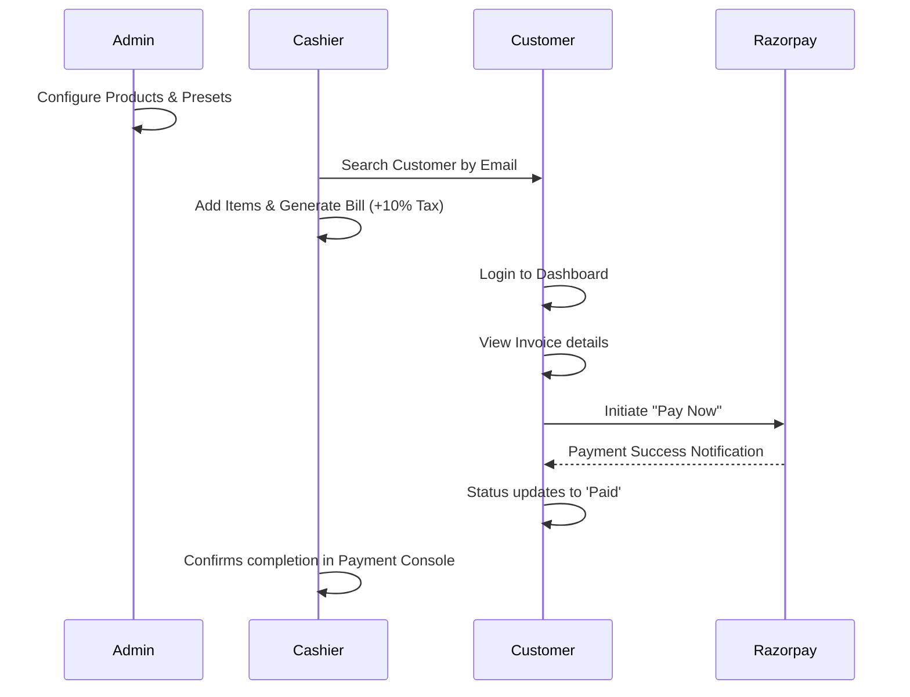
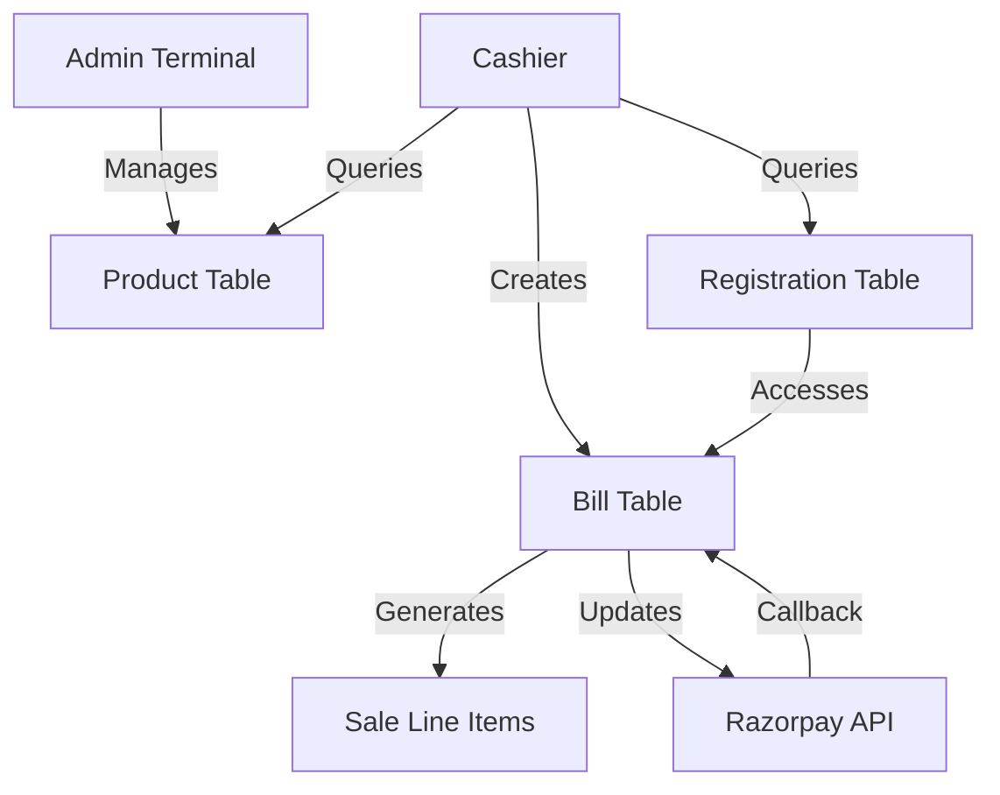

# 🚀 QR Billing Assistant & Payment Terminal

A premium, modern, and high-performance billing system built on **Django**. This application features three distinct portals: a comprehensive **Admin Dashboard**, a lightning-fast **Cashier Terminal**, and a sleek **Customer Dashboard** with integrated Razorpay payments.

---

## 🔑 Access Credentials

| Role | Username / Email | Password | URL Path |
| :--- | :--- | :--- | :--- |
| **Admin** | `admin` | `admin` *(or your superuser)* | `/admin/` |
| **Cashier** | `cashier` | `12345` | `/cashier_login/` |
| **Customer** | `shubham@mail.com` | `123` *(Example)* | `/login/` |

---

## 🛠 Modules & Features

### 1. 👮 Admin Dashboard
*   **Product Management**: Full CRUD operations for items, including unit price, GST percentages, and stock levels.
*   **Preset Management**: Flag specific items as "Presets" for rapid access by cashiers.
*   **User Oversight**: View and manage all registered customers within the ecosystem.
*   **Financial Reporting**: Live tracking of all payments and sales across the platform.

### 2. 💸 Cashier Terminal (Internal)
*   **Smart Billing**: Search for registered customers and generate dynamic QR bills in seconds.
*   **Preset Bundle Interface**: One-click access to common items for faster checkout.
*   **Payment Monitor**: Live status tracker to confirm when a customer has completed an online payment.
*   **Responsive Terminal**: Optimized for tablets and touch-screen cashier stations.

### 3. 👤 Customer Dashboard (Client-Facing)
*   **Transparent Billing**: View all current and past invoices in a premium, Row-based UI.
*   **Razorpay Integration**: Seamless "Pay Now" flow with real-time status updates.
*   **Digital Invoices**: Generate and download professional PDF-style invoices.
*   **User Profiles**: Manage personal information and secure account registration.

---

## 🔄 Business Workflow



---

## 📊 Data & System Flow

### Data Entities:
*   **registration**: Holds secure user authentication and profile data.
*   **Customer**: A secondary entity linked to bills for lightweight customer identification.
*   **Product**: The master inventory containing pricing and tax metadata.
*   **Bill**: The central transaction record (Status: Pending/Paid).
*   **Sale**: The granular line items linked to a specific Bill (e.g., 2x Milk, 1x Bread).

### Dataflow Diagram:



---

## 🚀 Tech Stack
*   **Backend**: Django (Python) 
*   **Frontend**: HTML5, Vanilla CSS3 (Glassmorphism & Modern Gradients)
*   **UI Framework**: Bootstrap 5 + Font Awesome 6
*   **Payments**: Razorpay API
*   **Database**: SQLite3 (Development)

---

## ⚙️ Installation & Setup

1.  **Clone the repository**
2.  **Install dependencies**:
    ```bash
    pip install django razorpay
    ```
3.  **Environment Setup**: 
    Add your Razorpay credentials to `settings.py`:
    ```python
    RAZOR_KEY_ID = 'your_key'
    RAZOR_KEY_SECRET = 'your_secret'
    ```
4.  **Run Migrations**:
    ```bash
    python manage.py migrate
    ```
5.  **Start Server**:
    ```bash
    python manage.py runserver
    ```

---
*Created by the QR Billing Assistant Team &bull; 2026*
